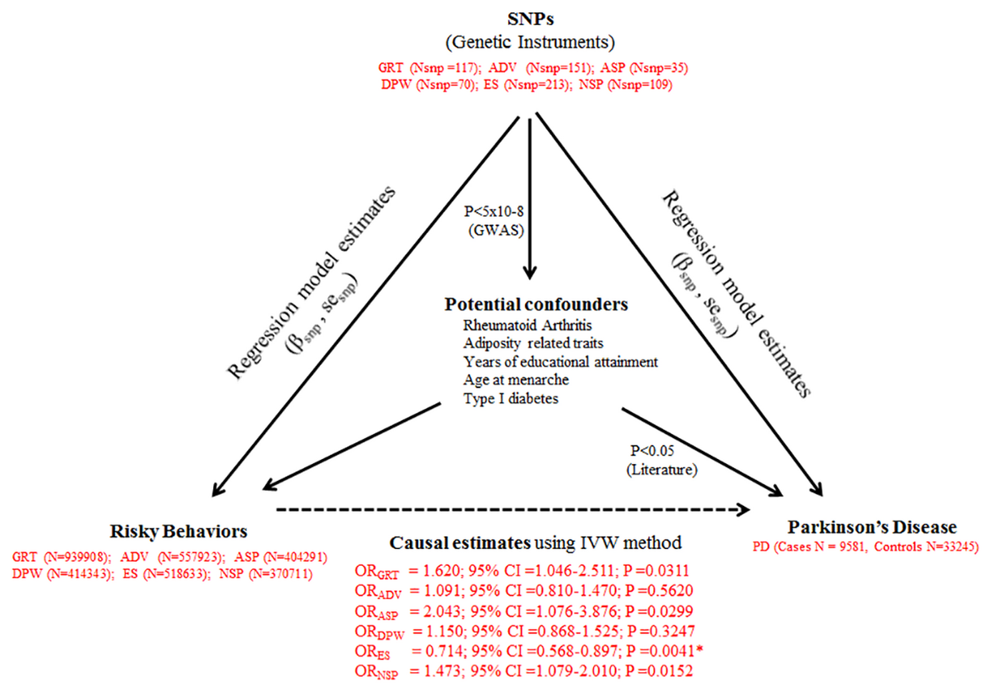

# mrpipeline



## Table of contents


- [Workflow overview](#workflow-overview)
- [Installation](#installation)
- [Description of the input files](#description-of-the-input-files)
    - [Main data file](#main-data-file)
    - [Meta file with additional details](#meta-file-with-additional-details)
- [Usage](#usage)


## Workflow overview

Complete pipeline for generating analysis for manuscript and poster:

1. Generation of triangular graph
2. Generation of power graph
3. Search for proxy SNPs in the exposure dataset
4. Synchronization of exposure and outcome datasets
5. Generation of tables (causal estimates using multiple MR methods, measures of heterogeneity and power analysis)
6. Generation of heat maps
7. Generation of sensitivity analysis graphs
8. Idenification of overlapping loci across multiple exposures
9. Plotting of Venn graphs
10. Causal estimates after removal of overlapping loci
11. Import of expression data 
12. Calculation of tissue specific causal estimates
13. Import of Phenoscanner data
14. Causal estimates after removal of SNPs associated with potential confounders


## Installation

``` r
# Install mrpipeline:
# From the directory containing .Rpoj file of the package
devtools::intstall()

# From the external repository
install.packages("mrpipeline")

# Or the the development version from GitHub:
# install.packages("devtools")
devtools::install_github("Sandyyy123/mrpipeline")
```
## Description of the input files

###  Main data file 

_(xlsx file)_

-  **Trait**="Exposure of interest"
-   **Leading SNP dbSNP id**="Genetic instrument"
-   **Chromosome position** (GRCh37.p13)="Chromosomal position"
-   **Effect Allele**="Effect Allele in exposure dataset"
-   **Other Allele**="Other Allele in exposure dataset"
-   **Effect Allele Frequency (EAF)**="Effect Allele Frequency in exposure dataset"
-   **Gene/ nearby gene**="Gene"
-   **Effect of lead variant on exposure levels (β)**="Effect of lead variant on exposure levels"
-   **Standard Error of Effect on exposure (SE)**="Standard Error of Effect on exposure"
-   **P-value**="Association P-value of genetic instrument with exposure dataset"		
-   **Outcome**="Outcome of interest"	 
-   **Use of Proxy SNP**="Yes/No"	
-   **Proxy SNP id**="Proxy SNP id if Yes in the previosu step"	 
-   **Distance from lead SNP (bp)**="Distance of proxy SNP from lead SNP" 	
-   **LD (r2) with lead SNP**="LD of proxy SNP with lead SNP in the exposure dataset"	
-   **Effect Allele**="Effect Allele in outcome dataset"	
-   **Other Allele**="Other Allele in outcome dataset"		
-   **Effect of lead variant on outcome levels (β)**="Effect of lead variant on outcome levels"	
-   **Standard Error of Effect on outcome (SE)**="Standard Error of Effect on outcome"	
-   **P-value**="Association P-value of genetic instrument with outcome dataset"

### Meta file with additional details 
_(yaml config file)_


```yaml
rnd_seed: 123                           # RNG seed
input_path: "/path/to/input/file.xlsx"  # Path to input file (see above)
metadata:
  n_out: 66164                          # Number of individuals in the outcome datase
  n_cas: 4127                           # Number of cases in the outcome dataset (categorical outcome variable)
  n_exp:
    Trait01: 518633                     # Number of individuals in the exposure dataset on trait01
    Trait02: 370711                     # Number of individuals in the exposure dataset on trait02
    Trait03: 318633
    ...
    TraitNN: 420711                     # Number of individuals in the exposure dataset on traitNN
```

## Usage

`run_mr` generates the tables and figures required for the MR pipeline. The output could be an html or doc file.

``` r
# load the library
library(mrpipeline)

# Set working directory
mr_dir <- "/path/to/working/directory"
setwd(mr_dir)

# Our working directory also contains input files (data file and config file)
config_file_name <- "config.yaml"
config <- file.path(getwd(), config_file_name)


# Run the MR results with output in html file
report_mr(config = config, output_format = "html_document", output_file = "mr_output.html", output_dir= mr_dir)

# Alterantively,Run the MR results with output in doc file
# Several other output options can be used as stated here: "https://rmarkdown.rstudio.com/lesson-9.html"
report_mr(config = config, output_format = "word_document", output_file = "mr_output.doc", output_dir= mr_dir)

# Check the results directly for html ouput file from console
browseURL(paste('file://', getwd(),'mr_output.html', sep='/')) 

```

To guide your reading, here's a translation between the terminology used in different places:

| function   | role | 
|--------------|---------|
| mr_raggr  | proxy snp identification    |
| import_mr_input   | wrangling    |
| compute_result_for_exposure | post-hoc power analysis |
| tangram_results    | generate table for manuscript  |
| experiment_heatmap    | generate heatamps  |
| plot_scatter    | generate plots for sensitivit analysis |
| venn_diagram  | generate venn diagram for overlap among variants |
| mr_gtex  | generate plots for overlap among variants |
| mr_pheno  | generate plots for overlap among variants |
| mr_uni  | generate causal estimates for unique loci |
| mr_tissue  | generate tissue specific causal estimates|
| mr_conf | generate causal estimates without SNPs associated with confounders |
| mr_forest  | generate forest plots for tissue specific SNPs or SNPs not associated with confounders|

## Cheatsheet

## Getting help

## Extended documentation or Further reading
[Understanding MR metholodogy and workflow](https://link.springer.com/protocol/10.1007%2F978-1-4939-7274-6_29)

[Critical appraisal of an MR manuscript](https://systematicreviewsjournal.biomedcentral.com/articles/10.1186/s13643-018-0809-3)

[Writing an MR manuscript](https://www.biorxiv.org/content/early/2018/11/02/446807)

[Creating a poster: Example 01](https://www.researchgate.net/publication/328449533_Risky_behaviors_and_Parkinson%27s_disease_A_Mendelian_randomization_study)

[Creating a poster: Example 02](https://www.researchgate.net/publication/328449543_Cardiovascular_Risk_Factors_and_Heart_Failure_with_Preserved_Ejection_Fraction_A_Mendelian_Randomization_Study)
